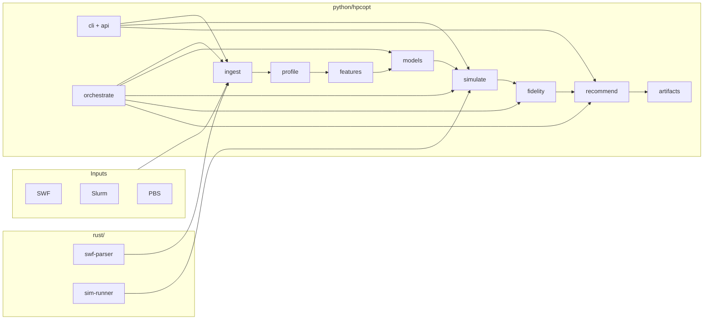
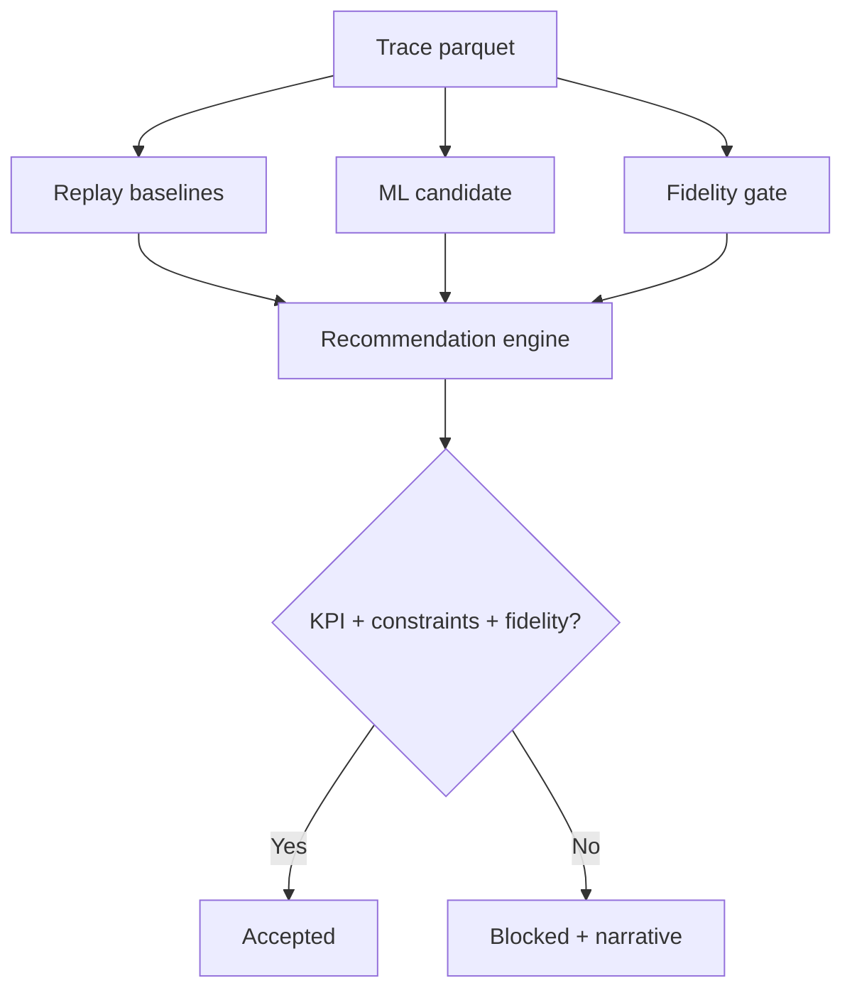
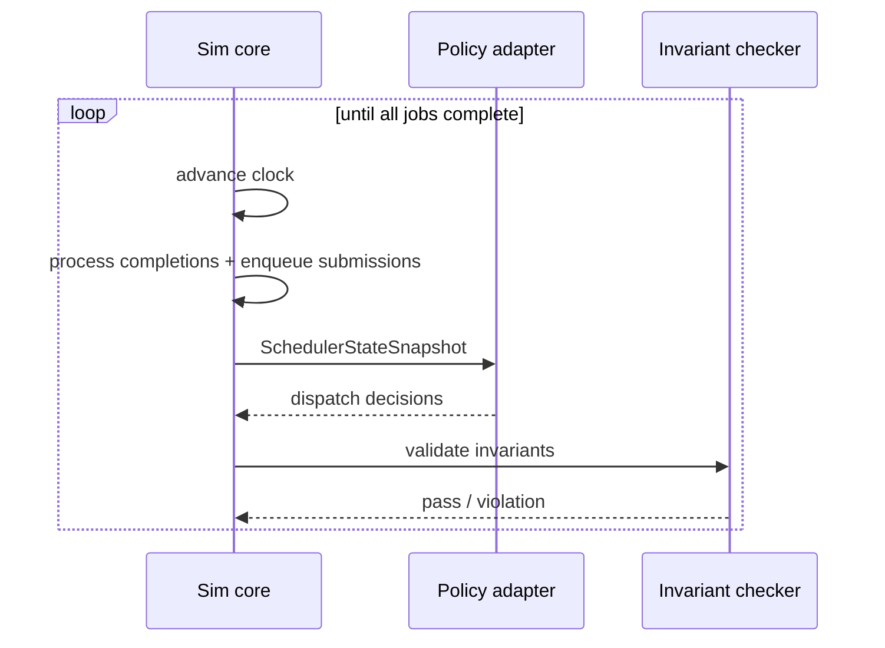
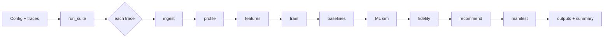
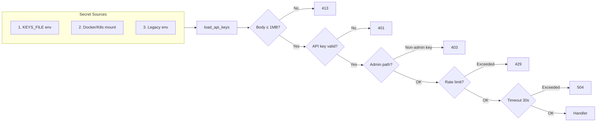
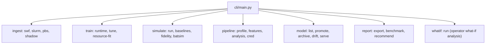

# HPC Workload Optimizer

[](https://github.com/ErenAri/HPC-workload-optimizer/actions/workflows/ci.yaml)
[](https://codecov.io/gh/ErenAri/HPC-workload-optimizer)
[](https://www.python.org/downloads/)
[](https://github.com/astral-sh/ruff)
[](LICENSE)
[](CITATION.cff)

**HPCOpt is a contract-driven evaluation harness for HPC scheduling claims** — a fast,
deterministic, reproducible referee for comparing scheduling policies (classic heuristics,
prediction-based backfill, ML/RL candidates) on real workload traces, with every claim gated by
executable invariants, trace-fidelity checks, and fairness/starvation constraints.

## Why

The field has good simulators and a steady stream of ML scheduling papers, but no standard,
auditable way to compare their claims. Typical evaluations optimize a single predictive metric on
a bespoke setup. HPCOpt enforces a stronger standard:

- scheduler behavior is explicitly specified (policy contracts),
- replay is deterministic (same trace + policy + seed → same result),
- invariants are executable (CPU conservation, temporal ordering — checked at every event),
- policy claims are gated by fidelity to the observed trace,
- recommendations are accepted only under hard fairness/starvation constraints,
- every run emits an immutable manifest (input/output hashes, seeds, environment fingerprint).

A candidate that improves mean wait but degrades the primary KPI is **blocked, with a narrative**
— exactly the over-claiming that contract-driven evaluation exists to prevent.

Strategic direction and competitive positioning: see [ROADMAP.md](ROADMAP.md).

## Primary Objective

Provide the evaluation layer that scheduling improvements must pass before anyone believes them:

- primary queueing objective (`p95 BSLD`) improvement, not cherry-picked secondary metrics,
- utilization maintained or improved,
- no fairness/starvation regressions,
- auditable artifacts for every claim.

## Benchmark Results (Parallel Workloads Archive)

### Full Policy Matrix

Every supported policy against every reference trace, on the Python reference simulator, with
prediction-based baselines included (Tsafrir user-history backfill; quantile-model backfill).
Results are published win or lose — the harness exists to prevent cherry-picking.

<!-- POLICY_MATRIX:BEGIN — generated by scripts/policy_matrix.py; do not hand-edit -->

| Trace | Policy | p95 BSLD | CPU Util | Mean Wait (s) | p95 Wait (s) |
|---|---|---|---|---|---|
| SDSC-SP2 | FIFO_STRICT | 56,784.93 | 76.8% | 1,552,128 | 5,103,921 |
| SDSC-SP2 | EASY_BACKFILL_BASELINE | 627.93 | 83.3% | 35,656 | 200,829 |
| SDSC-SP2 | CONSERVATIVE_BACKFILL_BASELINE | 550.82 | 83.4% | 28,708 | 133,802 |
| SDSC-SP2 | **SJF_BACKFILL** | **148.97** | 79.9% | 68,018 | 62,151 |
| SDSC-SP2 | LJF_BACKFILL | 457.76 | 83.2% | 87,073 | 134,968 |
| SDSC-SP2 | FAIRSHARE_BACKFILL | 158.53 | 80.0% | 97,688 | 52,708 |
| SDSC-SP2 | EASY_BACKFILL_TSAFRIR | 358.13 | 83.4% | 21,059 | 115,221 |
| SDSC-SP2 | ML_BACKFILL_P50 | 452.98 | 83.4% | 23,911 | 120,686 |
| SDSC-SP2 | ML_BACKFILL_P10 | 364.08 | 83.4% | 18,141 | 93,645 |
| SDSC-SP2 | RL_TRAINED ² | 271.83 | 83.3% | 31,226 | 80,535 |
| CTC-SP2 | FIFO_STRICT | 188.05 | 55.5% | 6,183 | 34,361 |
| CTC-SP2 | EASY_BACKFILL_BASELINE | 9.93 | 55.5% | 2,070 | 14,087 |
| CTC-SP2 | CONSERVATIVE_BACKFILL_BASELINE | 20.89 | 55.5% | 2,270 | 15,824 |
| CTC-SP2 | SJF_BACKFILL | 4.11 | 55.5% | 864 | 4,174 |
| CTC-SP2 | LJF_BACKFILL | 7.25 | 55.5% | 1,636 | 10,033 |
| CTC-SP2 | **FAIRSHARE_BACKFILL** | **3.59** | 55.5% | 801 | 3,175 |
| CTC-SP2 | EASY_BACKFILL_TSAFRIR | 6.28 | 55.5% | 1,454 | 9,132 |
| CTC-SP2 | ML_BACKFILL_P50 | 9.11 | 55.5% | 1,831 | 12,801 |
| CTC-SP2 | ML_BACKFILL_P10 | 6.61 | 55.5% | 986 | 5,719 |
| CTC-SP2 | RL_TRAINED ² | 3.85 | 55.5% | 714 | 2,750 |
| HPC2N | FIFO_STRICT | 286.98 | 59.6% | 16,189 | 68,219 |
| HPC2N | EASY_BACKFILL_BASELINE | 85.85 | 59.6% | 10,252 | 40,367 |
| HPC2N | CONSERVATIVE_BACKFILL_BASELINE | — ¹ | — | — | — |
| HPC2N | SJF_BACKFILL | 21.27 | 59.6% | 6,936 | 26,642 |
| HPC2N | LJF_BACKFILL | 46.32 | 59.6% | 10,169 | 40,374 |
| HPC2N | **FAIRSHARE_BACKFILL** | **19.14** | 59.6% | 7,465 | 25,854 |
| HPC2N | EASY_BACKFILL_TSAFRIR | 48.04 | 59.6% | 9,308 | 36,460 |
| HPC2N | ML_BACKFILL_P50 | 74.35 | 59.6% | 10,138 | 39,628 |
| HPC2N | ML_BACKFILL_P10 | 62.63 | 59.6% | 9,755 | 36,791 |
| HPC2N | RL_TRAINED ² | 31.09 | 59.6% | 8,885 | 30,708 |

¹ Not run: conservative backfill's full-queue reservations are computationally prohibitive on
HPC2N (~202K jobs; >3.4 h of simulation without completing). Its results on the other two traces
show it is not a front-runner. The sweep is resumable, so the cell can be filled in later.

² MaskablePPO, 200K timesteps per trace, single seed, RLScheduler (Zhang et al. SC'20)
hyperparameters, trained on random windows of the *same* trace it is evaluated on
(in-distribution, per the RLScheduler protocol). Cross-trace generalization is untested.

<!-- POLICY_MATRIX:END -->

**What the matrix says** (bold = best p95 BSLD per trace; zero invariant violations in all runs):

- **ML runtime prediction does not beat Tsafrir's 2007 heuristic.** On both congested traces the
  simple doubling-of-user-history estimate matches or beats LightGBM quantile prediction for
  EASY backfill: SDSC-SP2 358.13 vs 364.08 (ML p10), HPC2N 48.04 vs 62.63. This is the harness
  reporting honestly against its own ML feature — and it mirrors the field's open question of
  whether better runtime prediction actually translates into better schedules.
- **Queue ordering dominates runtime prediction.** Plain SJF and fair-share ordering beat every
  prediction-based EASY variant on all three traces.
- **p95 BSLD trades against utilization and mean wait.** SJF wins p95 BSLD on SDSC-SP2 but idles
  more of the machine (79.9% vs 83.4%) and triples mean wait vs Tsafrir — single-metric
  leaderboards mislead, which is why `hpcopt` gates verdicts on a constraint contract instead.
- **RL beats every prediction-based policy, but not simple queue ordering.** The MaskablePPO
  agent beats Tsafrir, ML backfill, and EASY on all three traces (and edges out SJF on CTC-SP2:
  3.85 vs 4.11) while holding EASY-class utilization — yet plain FAIRSHARE still wins two of
  three traces at zero training cost. Caveats in footnote ²: single seed, evaluated
  in-distribution on the training trace.

`RL_TRAINED` requires the `[rl]` extras; reproduce the checkpoints with
`scripts/train_rl_policy.py` (~20 min per trace on an RTX 2060).

Reproduce: `python scripts/policy_matrix.py`

### FIFO vs EASY (Rust engine)

All runs with the **Rust sim-runner** (< 0.6s per run for 200K+ jobs):

| Trace | Jobs | Policy | p95 BSLD | Utilization | Mean Wait |
|---|---|---|---|---|---|
| CTC-SP2 | 77,222 | FIFO | 188.05 | 55.5% | 6,183s |
| CTC-SP2 | 77,222 | **EASY_BACKFILL** | **4.91** | 55.5% | 1,883s |
| HPC2N | 202,870 | FIFO | 286.98 | 59.6% | 16,189s |
| HPC2N | 202,870 | **EASY_BACKFILL** | **33.90** | 59.6% | 11,193s |
| SDSC-SP2 | 54,044 | FIFO | 56,784.93 | 76.8% | 1,552,128s |
| SDSC-SP2 | 54,044 | **EASY_BACKFILL** | **275.73** | 83.3% | 22,882s |

Reproduce: `python scripts/benchmark_suite.py` (requires `cargo build --release` in `rust/`)

These numbers are cross-validated against **Batsim** (FIFO agreement within 0.7–3.5% on all
metrics across all traces) and the Python reference engine (exact agreement on SDSC FIFO).
EASY results differ between the Rust and Python engines (backfill tie-breaking is not yet pinned
by the metric contract), which is why the policy matrix above is reported from a single engine. The
cross-validation study — including the BSLD metric-parity defect it uncovered in the Rust engine
and the fix — is documented in
[docs/validation/batsim-agreement.md](docs/validation/batsim-agreement.md).

### Multi-resource scheduling on a modern GPU trace (PM100)

The Rust engine schedules on a `{cpus, gpus, mem}` resource vector (CPU-only remains the
default and is bit-identical to the published numbers above). First modern trace:
**PM100** ([Marconi100/CINECA, 231K jobs, 88% GPU, measured per-job power](https://doi.org/10.5281/zenodo.10127767)),
ingested via `hpcopt ingest pm100`. Replaying the same trace with and without the GPU/memory
dimensions measures the error a CPU-only simulator makes on a modern machine:

| Policy | Resource model | p95 BSLD | Mean Wait (s) | p95 Wait (s) | GPU Util |
|---|---|---|---|---|---|
| FIFO | CPU-only | 1.000 | 179 | 0 | — |
| FIFO | {cpus, gpus, mem} | **2.145** | 380 | 467 | 33.9% |
| EASY_BACKFILL | CPU-only | 1.000 | 151 | 0 | — |
| EASY_BACKFILL | {cpus, gpus, mem} | **1.739** | 278 | 311 | 33.9% |

A CPU-only model sees an empty machine (26% CPU utilization, zero p95 wait); modeling GPUs
reveals the actual contention — GPUs, not CPUs, are the binding resource on Marconi100. It also
overestimates peak facility power 2× (2,296 kW vs 1,125 kW) by co-scheduling GPU jobs that cannot
actually coexist. PM100 contains only the machine's exclusive-resource jobs, so absolute
congestion is understated; the cross-model comparison on identical input is the point.

### Energy and power as first-class metrics

Jobs carry measured mean power (watts) into the simulator, which integrates the cluster's power
profile over time: total energy, peak power, and exposure above a facility cap
(`--power-cap-watts`). With `--enforce-power-cap`, dispatch holds the cap as a hard constraint —
a job starts only if the cluster's draw stays under it. Replaying PM100 on half the machine
(a partition under a 700 kW cap) exposes the tradeoff energy-aware schedulers actually navigate:

| Policy | Cap | p95 BSLD | Energy (MWh) | Peak Power (kW) | Hours Above Cap |
|---|---|---|---|---|---|
| FIFO | measured | 5,604.71 | 1,227.8 | 863.0 | 0.04 |
| FIFO | **enforced** | 5,604.71 | 1,227.8 | 672.7 | 0.00 |
| EASY_BACKFILL | measured | **152.33** | 1,227.8 | 759.5 | 1.37 |
| EASY_BACKFILL | **enforced** | **152.24** | 1,227.8 | 700.0 | 0.00 |

Three facts a single-metric leaderboard would hide: energy is schedule-invariant (identical
column — scheduling changes *when* power is drawn, not how much); backfilling sustains draw near
the envelope (EASY spends 34× longer above the cap than FIFO despite a lower instantaneous
peak); and on this workload **enforcing the cap is free** — the over-cap draw reschedules into
existing headroom with no measurable p95 BSLD cost (152.24 vs 152.33) and every job still
completing. That last claim is exactly the kind of operator what-if the harness exists to grade.

Reproduce: `python scripts/pm100_multiresource_study.py`

## How HPCOpt Compares to Existing Tools

| Tool | What it is | What HPCOpt adds |
|---|---|---|
| [Batsim](https://batsim.readthedocs.io/) | SimGrid-based RJMS simulator; the research standard | Direct SWF/Slurm/PBS ingestion (no trace conversion), tested contract/invariant layer, fidelity gating, `pip install` instead of a Nix/SimGrid toolchain. HPCOpt also drives Batsim as an optional backend for cross-validation. |
| [Slurm Simulator (UB CCR)](https://ubccr-slurm-simulator.github.io/) | Patched Slurm codebase for what-if analysis | Speed (~17 simulated days/hour there vs. 200K jobs in <0.3s here) and no lock-in to a specific patched Slurm version. |
| [RLScheduler](https://github.com/DIR-LAB/deep-batch-scheduler) / ML scheduling papers | Individual policy proposals, each with bespoke evaluation | A neutral, reproducible, constraint-gated harness to compare them on equal footing — policies are plug-ins, not competitors. |
| CQSim / Alea | Event-driven scheduling simulators | Executable invariants, fidelity gates against observed traces, immutable run manifests, CI-enforced cross-language parity. |

HPCOpt is **not** a production scheduler and does not compete with Slurm, PBS, or Flux — it is
the evaluation and advisory layer around them.

## Implemented Capabilities (Current State)

### Core Pipeline

- Multi-format ingestion (SWF, Slurm `sacct --parsable2`, PBS/Torque accounting logs, PM100/Marconi100 job-power table with GPU and per-job energy columns) with canonical parquet export and quality reporting.
- Reference-suite trace hash locking and enforcement.
- Trace profiling for heavy-tail, congestion, over-request, and user-skew analysis.
- Time-safe feature engineering pipeline with chronological cross-validation splits.
- Runtime quantile modeling (`p10/p50/p90`) with monotonic inference enforcement.
- Runtime baseline-lift reporting against naive comparators (global mean/median and user-history median).
- Resource-fit modeling: fragmentation risk classifier + optimal node size regressor.

### Simulation and Evaluation

- Deterministic simulation core for ten policies: `FIFO_STRICT`, `EASY_BACKFILL_BASELINE`, `CONSERVATIVE_BACKFILL_BASELINE` (Mu'alem & Feitelson TPDS 2001 — reservations for *all* queued jobs, on a free-CPU availability profile), `EASY_BACKFILL_TSAFRIR` (Tsafrir/Etsion/Feitelson 2007 user-history predictor), `SJF_BACKFILL`, `LJF_BACKFILL`, `FAIRSHARE_BACKFILL` (decayed-usage Slurm-style multifactor priority), `ML_BACKFILL_P50`, `ML_BACKFILL_P10`, and `RL_TRAINED` (MaskablePPO agent trained via the RLScheduler-style env in `python/hpcopt/rl/`; install `[rl]` extras to train).
- Invariant reporting with strict-fail mode.
- Baseline fidelity gate (aggregate + distribution + queue-correlation checks).
- Stress scenario generation (heavy-tail, low-congestion, user-skew, burst-shock) and automated stress testing.
- Recommendation engine with primary KPI gating, fairness/starvation constraints, Pareto multi-objective mode, and failure-mode narratives.
- Benchmark suite with parse/simulation/pipeline throughput metrics, history ledger, and regression gate.
- Batsim integration path: config generation, run invocation (native/WSL), output normalization, optional candidate fidelity report.

### Model Management and Operations

- Model registry (append-only JSONL) with register/promote/archive lifecycle.
- Drift detection: Population Stability Index (PSI) per feature and pinball loss degradation tracking.
- Hyperparameter tuning with random search/Optuna and chronological cross-validation, with backend selection (`sklearn` or `lightgbm`).
- Feature importance analysis via permutation importance.
- Shadow ingestion daemon for incremental Slurm/PBS polling with watermark persistence.
- Artifact retention management with production-model and dossier-reference protection.

### Credibility and Reproducibility

- Full credibility protocol: automated multi-trace suite runs with per-trace fidelity, sensitivity, and recommendation outcomes, including optional sklearn+LightGBM predictor ensembling.
- Credibility dossier assembly (JSON + markdown) with cross-trace summary.
- Policy sensitivity sweeps over guard coefficient (`k`) parameter space.
- Immutable run manifest generation with hashes, config snapshots, seeds, and environment fingerprints.
- Artifact export bundles (JSON + markdown).

### Deployment and Observability

Production API (FastAPI) with runtime/resource-fit prediction endpoints, hardened middleware
(auth + admin RBAC, rate limiting, 1MB body cap, timeouts, circuit breaker, RFC 7807 errors),
Prometheus/OpenTelemetry observability, Docker + Kubernetes manifests, and 17-job CI/CD with
coverage, SAST, secret scanning, and cross-language parity gates.

Full operational evidence (readiness matrix, smoke/load test results, K8s architecture, CI
pipeline): **[docs/production-evidence.md](docs/production-evidence.md)**.

### Cross-Language

- Rust utilities for parser stats and scheduler adapter contract parity.
- Rust release profile with LTO, strip, single codegen unit, and saturating arithmetic for overflow safety.
- Mandatory cross-language adapter parity test in CI (Python/Rust decision equivalence).

## Architecture

```text
Raw traces (SWF / Slurm sacct / PBS accounting)
  -> Canonical ingestion (parquet + quality report)
  -> Trace profiling
  -> Feature engineering + chronological splits
  -> Runtime quantile training (+ tuning + importance analysis)
  -> Resource-fit training
  -> Policy replay (native core and Batsim-normalized path)
  -> Fidelity + objective contract evaluation
  -> Stress testing across synthetic scenarios
  -> Recommendation generation (single-objective or Pareto)
  -> Credibility dossier assembly
  -> Exportable artifacts with immutable manifests
```

Language partition:

- Python: orchestration, simulation logic, ML, fidelity, recommendations, CLI/API, observability.
- Rust: SWF parser utility, deterministic runner scaffolding, adapter contract parity binary.

### Architecture Diagrams

<details>
<summary><strong>1) Component and language boundary view</strong></summary>



</details>

<details>
<summary><strong>2) Policy evaluation and recommendation gate</strong></summary>



</details>

<details>
<summary><strong>3) Deterministic simulation event loop</strong></summary>



</details>

<details>
<summary><strong>4) Credibility suite orchestration path</strong></summary>



</details>

<details>
<summary><strong>5) Security and secrets architecture</strong></summary>



</details>

<details>
<summary><strong>6) CLI module architecture</strong></summary>



</details>

## Repository Map

```text
python/hpcopt/
  cli/           # Typer command surface (modular: ingest, train, simulate, report, pipeline, model)
  api/           # FastAPI service (modular: app assembler + models, errors, middleware, endpoints, auth, rate_limit, model_cache, deprecation, metrics, tracing)
  ingest/        # SWF, Slurm, PBS parsers + shadow ingestion daemon
  profile/       # Trace profiling and workload characterization
  features/      # Time-safe feature pipeline + chronological splits
  models/        # Runtime quantile, resource-fit, drift, tuning, registry, model card
  simulate/      # Policy core, adapter, fidelity, Batsim, stress scenarios
  recommend/     # Recommendation engine with Pareto mode
  whatif/        # Operator what-if analysis (fidelity-graded policy/capacity change evaluation)
  artifacts/     # Manifests, export, benchmarks, credibility dossier, retention
  analysis/      # Sensitivity sweeps, feature importance
  orchestrate/   # Credibility protocol orchestrator
  utils/         # I/O, structured logging, config validation, file-based secrets
  py.typed       # PEP 561 marker for downstream type checking

rust/
  swf-parser/    # Fast SWF line parser/statistics utility
  sim-runner/    # Deterministic runner and adapter contract binaries

k8s/               # Kubernetes manifests
  namespace.yaml
  deployment.yaml  # 2-replica Deployment with probes, security context, preStop hook
  service.yaml     # ClusterIP service
  configmap.yaml   # Environment configuration
  secret.yaml      # API keys template
  hpa.yaml         # HorizontalPodAutoscaler (2-8 replicas)
  pdb.yaml         # PodDisruptionBudget (minAvailable: 1)
  network-policy.yaml  # NetworkPolicy (ingress from ingress-nginx + monitoring)
  servicemonitor.yaml  # Prometheus auto-discovery
  otel-collector.yaml  # OpenTelemetry Collector deployment
  alertmanager-config.yaml  # PagerDuty + Slack alert routing

configs/
  data/          # Reference suite configuration
  simulation/    # Fidelity gate, policy configs
  credibility/   # Credibility sweep configuration
  models/        # Drift threshold configuration
  benchmark/     # Benchmark suite configuration
  monitoring/    # Grafana dashboard
  api/           # API deprecation schedule
  environments/  # Per-environment configs (dev, staging, prod)
  release/       # Production readiness checklist

schemas/
  run_manifest, fidelity, invariant, adapter, policy, credibility,
  sensitivity, reference_suite, fidelity_gate_config schemas

tests/
  unit/          # 300+ unit tests (CLI, API, schemas, secrets, adapters, simulation, property-based, security, concurrency, error paths)
  integration/   # API and protocol integration tests + E2E smoke test
  load/          # API load/concurrency tests
  conftest.py    # Shared fixtures (api_client, sample_trace_path, stress_dataset)

docs/              # Formal technical documentation corpus
  ops/           # SLO, logging, scaling, persistent state, tracing, deployment safety
  runbooks/      # Incident response, latency, 5xx, fallback spike, rollback
  security/      # Secrets, vulnerability management, access control
  mlops/         # Model lifecycle
  api/           # Versioning and deprecation

design_docs/       # Planning contracts and research appendix
```

## Installation

```bash
python -m pip install -e ".[dev]"
```

Optional (for Rust tools):

```bash
cargo --version
rustc --version
```

### Docker

```bash
# Create secrets directory with API keys
mkdir -p secrets
echo "my-secret-api-key" > secrets/api_keys.txt

docker compose up --build
```

Or standalone:

```bash
docker build -t hpcopt .
docker run -p 8080:8080 -e HPCOPT_API_KEYS=my-key hpcopt
```

## Quickstart (Minimal End-to-End)

**Automated demo** (runs the full pipeline in one command):

```bash
python examples/quickstart.py
```

This ingests a real SWF trace, profiles it, builds features, trains quantile models, replays 3 scheduling policies, runs the fidelity gate, and generates a recommendation report. Outputs go to `outputs/quickstart/`.

**Manual steps** (for fine-grained control):

### 1) Ingest a trace

```bash
# SWF format
hpcopt ingest swf \
  --input data/raw/CTC-SP2-1996-3.1-cln.swf.gz \
  --dataset-id ctc_sp2_1996 \
  --out data/curated \
  --report-out outputs/reports

# Slurm sacct format
hpcopt ingest slurm \
  --input /var/log/slurm/sacct_dump.txt \
  --out data/curated

# PBS/Torque accounting log
hpcopt ingest pbs \
  --input /var/spool/pbs/server_priv/accounting/20260101 \
  --out data/curated
```

### 2) Build trace profile

```bash
hpcopt profile trace \
  --dataset data/curated/ctc_sp2_1996.parquet \
  --out outputs/reports
```

### 3) Build time-safe feature dataset and chronological splits

```bash
hpcopt features build \
  --dataset data/curated/ctc_sp2_1996.parquet \
  --out data/curated \
  --report-out outputs/reports \
  --n-folds 3
```

### 4) Train models

```bash
# Runtime quantile model
hpcopt train runtime \
  --dataset data/curated/ctc_sp2_1996.parquet \
  --out outputs/models \
  --backend sklearn \
  --model-id runtime_ctc_v1

# Hyperparameter tuning
hpcopt train tune \
  --dataset data/curated/ctc_sp2_1996.parquet \
  --out outputs/reports \
  --quantile 0.5 \
  --n-trials 20 \
  --backend sklearn

# Resource-fit model
hpcopt train resource-fit \
  --dataset data/curated/ctc_sp2_1996.parquet \
  --out outputs/models \
  --backend sklearn
```

### 5) Replay baselines

```bash
hpcopt simulate replay-baselines \
  --trace data/curated/ctc_sp2_1996.parquet \
  --capacity-cpus 64 \
  --strict-invariants
```

### 6) Run ML candidate policy

```bash
hpcopt simulate run \
  --trace data/curated/ctc_sp2_1996.parquet \
  --policy ML_BACKFILL_P50 \
  --capacity-cpus 64 \
  --runtime-guard-k 0.5 \
  --strict-uncertainty-mode \
  --strict-invariants

# Conservative variant (uses p10 runtime estimate)
hpcopt simulate run \
  --trace data/curated/ctc_sp2_1996.parquet \
  --policy ML_BACKFILL_P10 \
  --capacity-cpus 64 \
  --runtime-guard-k 0.5 \
  --strict-invariants
```

### 7) Execute fidelity gate

```bash
hpcopt simulate fidelity-gate \
  --trace data/curated/ctc_sp2_1996.parquet \
  --capacity-cpus 64
```

### 8) Generate recommendation

```bash
hpcopt recommend generate \
  --baseline-report <easy_baseline_sim_report.json> \
  --candidate-report <ml_candidate_sim_report.json> \
  --fidelity-report <fidelity_report.json> \
  --out outputs/reports

# Pareto multi-objective mode
hpcopt recommend generate \
  --baseline-report <baseline.json> \
  --candidate-report <candidate1.json> \
  --candidate-report <candidate2.json> \
  --pareto \
  --out outputs/reports
```

### 9) Export run bundle

```bash
hpcopt report export --run-id <run_id> --format both
```

### 10) Run benchmark suite

```bash
hpcopt report benchmark \
  --trace data/curated/ctc_sp2_1996.parquet \
  --raw-trace data/raw/CTC-SP2-1996-3.1-cln.swf.gz \
  --policy FIFO_STRICT \
  --capacity-cpus 64 \
  --samples 3
```

## Model Management

```bash
# List registered models
hpcopt model list

# Promote a model to production
hpcopt model promote --model-id runtime_ctc_v1

# Archive a model
hpcopt model archive --model-id runtime_ctc_v0

# Check for drift against new data
hpcopt model drift-check \
  --eval-dataset data/curated/new_trace.parquet \
  --model-dir outputs/models/runtime_ctc_v1
```

## Credibility Protocol

Run the full credibility suite across all reference traces:

```bash
hpcopt credibility run-suite \
  --config configs/credibility/default_sweep.yaml \
  --raw-dir data/raw \
  --out outputs/credibility
```

Assemble the credibility dossier:

```bash
hpcopt credibility dossier \
  --input-dir outputs/credibility \
  --out outputs/credibility/dossier
```

## Analysis

```bash
# Policy sensitivity sweep (guard coefficient k)
hpcopt analysis sensitivity-sweep \
  --trace data/curated/ctc_sp2_1996.parquet \
  --capacity-cpus 64 \
  --k-values "0.0,0.25,0.5,0.75,1.0,1.5"

# Feature importance analysis
hpcopt analysis feature-importance \
  --model-dir outputs/models/runtime_ctc_v1 \
  --dataset data/curated/ctc_sp2_1996.parquet
```

## Stress Testing

```bash
# Generate a stress scenario
hpcopt stress gen --scenario heavy_tail --out data/curated --n-jobs 5000

# Run stress test against a policy
hpcopt stress run \
  --scenario heavy_tail \
  --policy configs/simulation/policy_ml_backfill.yaml \
  --model runtime_latest \
  --capacity-cpus 64
```

## Artifact Retention

```bash
# Preview stale artifacts (dry run)
hpcopt artifacts cleanup --outputs-dir outputs --max-age-days 90

# Delete stale artifacts (protects production model and dossier references)
hpcopt artifacts cleanup --outputs-dir outputs --max-age-days 90 --no-dry-run
```

## What-If Analysis (Operator Mode)

Evaluate a scheduler change against your own accounting data before applying it in production —
seconds of simulation instead of weeks of watching a changed cluster:

```bash
# From a raw `sacct --parsable2` dump:
hpcopt whatif run \
  --sacct /var/log/slurm/sacct_dump.txt \
  --candidate-policy SJF_BACKFILL

# Or from a canonical parquet trace, with an explicit Slurm SchedulerType mapping:
hpcopt whatif run \
  --trace data/curated/ctc_sp2_1996.parquet \
  --slurm-scheduler-type sched/builtin \
  --capacity-cpus 512

# Capacity what-if (same policy, more CPUs):
hpcopt whatif run \
  --trace data/curated/ctc_sp2_1996.parquet \
  --candidate-policy EASY_BACKFILL_BASELINE \
  --candidate-capacity-cpus 640
```

The report grades its own trustworthiness: the baseline replay is checked against observed
behavior by the fidelity gate, and every verdict carries that confidence grade plus an explicit
"not modeled" caveat list. KPI deltas that violate fairness/starvation constraints are **blocked**,
not reported as wins. Cluster capacity is inferred from peak observed concurrency when not given.

Demo with synthetic data: `python examples/whatif_demo.py`

## Shadow Ingestion (Incremental Polling)

```bash
hpcopt ingest shadow-start \
  --source-type slurm \
  --source-path /var/log/slurm/sacct_dump.txt \
  --interval-sec 300
```

Polls the scheduler data source periodically, applies watermark-based deduplication, and writes incremental parquet files.

## Batsim Workflow (Simulation Backend Path)

Generate Batsim run config:

```bash
hpcopt simulate batsim-config \
  --trace data/curated/ctc_sp2_1996.parquet \
  --policy FIFO_STRICT \
  --run-id batsim_ctc
```

Dry run:

```bash
hpcopt simulate batsim-run \
  --config outputs/simulations/batsim_ctc_batsim_run_config.json \
  --dry-run
```

Live run (example on Windows host with WSL):

```bash
hpcopt simulate batsim-run \
  --config outputs/simulations/batsim_ctc_batsim_run_config.json \
  --use-wsl \
  --no-dry-run
```

When live run succeeds and normalization is enabled, the command emits:

- normalized jobs and queue parquet artifacts,
- simulation report in standard format,
- invariant report,
- optional candidate fidelity report.

## API

Start service:

```bash
hpcopt serve api --host 0.0.0.0 --port 8080
```

Available endpoints:

- `GET /health` -- service health
- `GET /ready` -- readiness check (model availability; returns 503 when degraded)
- `GET /v1/system/status` -- process uptime + model/metrics availability status
- `POST /v1/runtime/predict` -- runtime quantile predictions
- `POST /v1/resource-fit/predict` -- resource fit and fragmentation risk
- `GET /v1/recommendations/{run_id}` -- retrieve stored recommendation results
- `POST /v1/admin/log-level` -- dynamic log level (admin RBAC required)
- `GET /metrics` -- Prometheus metrics (when `prometheus_client` is installed)

OpenAPI docs: `http://localhost:8080/docs`

Authentication: API key authentication is enabled when keys are configured via any of:

1. `HPCOPT_API_KEYS_FILE` env var pointing to a file (one key per line),
2. Docker/K8s secret mount at `/run/secrets/hpcopt_api_keys`,
3. `HPCOPT_API_KEYS` env var (comma-separated, legacy).

Requests must include `X-API-Key` header. Health, readiness, metrics, docs, OpenAPI, and system status endpoints are always exempt (see `api/auth.py:EXEMPT_PATHS`). Keys are re-read on every request, enabling rotation without restart.

Runtime prediction endpoint automatically uses trained model artifacts when available; otherwise it falls back to deterministic heuristic behavior. The model cache is pre-warmed at startup to avoid cold-start latency on the first request.

Request timeout: all requests are subject to a configurable timeout (default 30s, set via `HPCOPT_REQUEST_TIMEOUT_SEC` env var). Requests exceeding the timeout return `504 GATEWAY_TIMEOUT`.

API response contract:

- every response includes `X-Trace-ID` and `X-Correlation-ID`,
- prediction responses include `X-Model-Version` and `X-Fallback-Used`,
- deprecated endpoints include `Deprecation`, `Sunset`, and `Link` headers (RFC 8594/9745),
- error responses follow **RFC 7807 Problem Details** format with `type` (urn:hpcopt:error:*), `title`, `status`, `detail`, `instance` (trace ID), and optional `errors` array. Status codes: `422 VALIDATION_ERROR`, `401 UNAUTHORIZED`, `403 FORBIDDEN` (admin paths), `413 PAYLOAD_TOO_LARGE` (requests > 1MB), `429 RATE_LIMITED`, `504 GATEWAY_TIMEOUT`, `500 INTERNAL_ERROR`.

## Reproducibility and Contracts

The project emits immutable manifests and schema-bound artifacts:

- `schemas/run_manifest.schema.json`
- `schemas/invariant_report.schema.json`
- `schemas/fidelity_report.schema.json`
- `schemas/adapter_snapshot.schema.json`
- `schemas/adapter_decision.schema.json`
- `schemas/policy_config.schema.json`
- `schemas/fidelity_gate_config.schema.json`
- `schemas/reference_suite_config.schema.json`
- `schemas/credibility_dossier.schema.json`
- `schemas/sensitivity_report.schema.json`

Each run manifest records:

- command and timestamp,
- input/output hashes,
- package/tool versions,
- policy hash,
- config snapshots,
- environment fingerprint,
- seeds,
- manifest self-hash.

## Reference Suite Lock

Lock or refresh trace hashes:

```bash
hpcopt data lock-reference-suite \
  --config configs/data/reference_suite.yaml \
  --raw-dir data/raw
```

## Testing

```bash
pytest -v
```

Current baseline: **420 tests passing** with **86% minimum coverage** (enforced in CI, **86.14% actual**).

Test suite covers:

- unit tests (ingestion, profiling, training, simulation, fidelity, recommendation, benchmarks, reproducibility),
- **property-based tests** (Hypothesis, max_examples=100) for CPU conservation law, temporal ordering invariant, metric monotonicity, adapter contracts, objective bounds, and recommendation engine,
- CLI tests (ingest swf/slurm/pbs, train, simulate, pipeline, model, report — all 14 command groups),
- schema validation tests (all 11 JSON schemas checked for well-formedness and `additionalProperties` lockdown),
- **security tests** (request body size limits, input bounds validation, admin RBAC, extra field rejection, path traversal protection),
- **concurrency tests** (thread-safe cache, circuit breaker state transitions),
- **error path tests** (specific exception types across 11 modules, replacing broad `except Exception`),
- secrets module tests (file-based, Docker mount, legacy env, missing file, read timeout),
- API contract tests (rate limiting, request timeout, RFC 7807 error responses),
- API deprecation header tests,
- API metrics, model cache, and rate limit unit tests,
- model registry, drift detection, tuning, resource-fit, and credibility dossier tests,
- ingestion tests (PBS, shadow, Slurm helpers), retention, report export, feature importance, config validation, env config, logging, and tracing tests,
- integration tests (API endpoints, auth, credibility protocol, Slurm ingestion),
- **E2E pipeline smoke test** (ingest → features → train → predict),
- **load tests**: spike (0→100 concurrent), sustained (5s continuous), error rate verification (<1%), tail latency assertions (p99 < 2x p95).

Coverage enforcement: `pytest-cov` with `--cov-fail-under=86` plus `scripts/check_coverage_thresholds.py` package-floor checks and Codecov PR comments in CI.

### Unified Verification Gate (PowerShell)

Run all industrial verification gates (correctness, benchmark regression, API load, fidelity/recommendation, reproducibility):

```powershell
powershell -ExecutionPolicy Bypass -File scripts/verify.ps1
```

Strict policy acceptance mode (fails unless fidelity=`pass` and recommendation=`accepted`):

```powershell
powershell -ExecutionPolicy Bypass -File scripts/verify.ps1 -StrictQuality
```

Use an existing canonical dataset:

```powershell
powershell -ExecutionPolicy Bypass -File scripts/verify.ps1 -TraceDataset data/curated/ctc_sp2_1996.parquet
```

API compatibility check:

```bash
python scripts/check_openapi_compat.py --baseline schemas/openapi_baseline.json
```

Disaster recovery drill (local backup/restore rehearsal):

```bash
python scripts/dr_backup_restore_drill.py
```

## Documentation

Primary docs:

- `docs/README.md`
- `docs/production-readiness-checklist.md`
- `docs/ops/slo-and-error-budget.md`
- `docs/ops/ownership-matrix.md`
- `docs/ops/model-acceptance.md`
- `docs/ops/deployment-safety.md`
- `docs/ops/disaster-recovery.md`
- `docs/ops/logging.md`
- `docs/ops/scaling.md`
- `docs/ops/persistent-state.md`
- `docs/ops/tracing.md`
- `docs/runbooks/incident-response.md`
- `docs/runbooks/api-latency-degradation.md`
- `docs/runbooks/high-5xx-rate.md`
- `docs/runbooks/model-fallback-spike.md`
- `docs/runbooks/release-rollback.md`
- `docs/security/secrets-management.md`
- `docs/security/vulnerability-management.md`
- `docs/security/access-control.md`
- `docs/mlops/model-lifecycle.md`
- `docs/api/versioning-and-deprecation.md`
- `docs/01-project-charter.md`
- `docs/02-system-architecture.md`
- `docs/03-data-model-and-ingestion.md`
- `docs/04-policy-and-simulation-contract.md`
- `docs/05-ml-runtime-modeling.md`
- `docs/06-fidelity-objective-and-recommendation.md`
- `docs/07-interfaces-cli-and-api.md`
- `docs/08-reproducibility-and-artifacts.md`
- `docs/09-experiment-protocol-mvp.md`
- `docs/10-roadmap-and-open-problems.md`
- `docs/11-engineering-maturity-program.md`

Design and contract history:

- `design_docs/mvp_design_plan_python_rust_batsim.md`
- `design_docs/policy_spec_baselines_mvp.md`
- `design_docs/mvp_backlog_p0_p1_p2.md`
- `design_docs/systems_first_research_appendix.md`

Engineering maturity execution artifacts:

- `program/engineering-maturity/README.md`
- `program/engineering-maturity/epics.yaml`
- `program/engineering-maturity/milestones.yaml`
- `program/engineering-maturity/kpi-dashboard.sample.json`
- `schemas/engineering_kpi_dashboard.schema.json`

## Kubernetes Deployment and CI/CD

Kubernetes manifests live in `k8s/`; deployment steps, architecture diagram, and the CI/CD
pipeline diagram are in **[docs/production-evidence.md](docs/production-evidence.md)**. See
`docs/ops/scaling.md` for scaling guidance.

## Production Readiness Evidence

Readiness matrix, container smoke test (13/13 checks), and Locust load test results now live in
**[docs/production-evidence.md](docs/production-evidence.md)**. All claims there are
machine-verified in CI; the release gate checklist is `configs/release/production_readiness.yaml`.

## Validated Performance

### Runtime Model Training (CTC-SP2 benchmark trace)

| Metric | Value |
|---|---|
| Trace size | 77,222 jobs |
| Train / Valid / Test split | 54,055 / 11,583 / 11,584 |
| p50 MAE (model) | 7,889 sec |
| p50 MAE improvement vs global mean | 42.3% (5,777 sec) |
| p50 MAE improvement vs user-history median | 19.9% (1,964 sec) |
| Prediction interval coverage (p10–p90) | 78.1% |

Reproduce: `scripts/docker_smoke_test.py`, `scripts/load/locustfile.py`, `hpcopt credibility run-suite`.


## Release Gate

Production release tags are gated by `scripts/production_readiness_gate.py` against
`configs/release/production_readiness.yaml`.

- CI (`push`/`PR`) runs checklist structural validation (`--mode validate`).
- Release workflow (`v*` tags) runs strict gate (`--mode release`), which requires:
  - every required check marked `done`,
  - non-empty evidence for each required check,
  - recent `metadata.reviewed_at_utc` (<=30 days old).
- CI also runs:
  - OpenAPI compatibility baseline check (`scripts/check_openapi_compat.py`),
  - bandit SAST scanning (`bandit -r python/hpcopt/ -ll -ii`),
  - security dependency audit (`pip-audit`),
  - secret scanning (`gitleaks`),
  - Rust linting (`clippy --deny warnings`), `cargo test`, and release build,
  - mandatory cross-language adapter parity test,
  - automated E2E pipeline smoke test,
  - Docker container smoke test (health/ready/predict),
  - Grafana dashboard JSON validation,
  - Codecov coverage reporting to PR comments.
