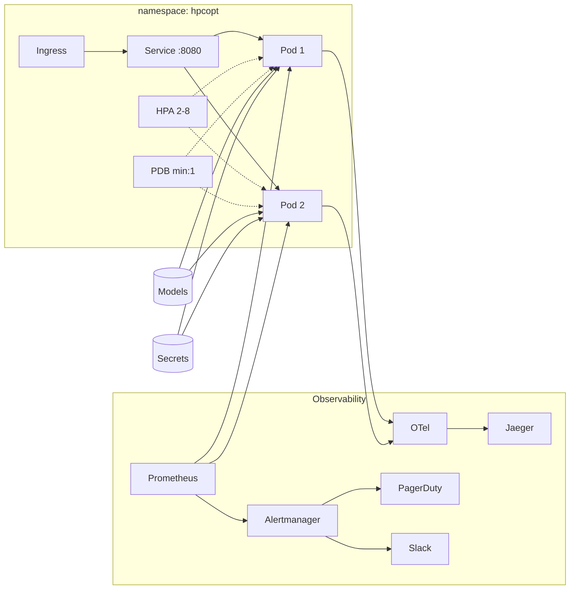
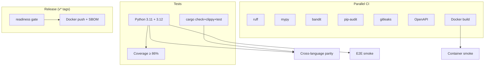
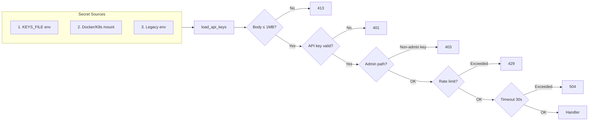

# Production Evidence

Operational evidence for the HPCOpt API service. This material was moved out of the README to
keep the project front page focused on the scientific contribution; nothing here gates the
research claims. All numbers are machine-verified in CI.

## Production Readiness Matrix

| Dimension | Metric | Evidence |
|---|---|---|
| **Testing** | 420 tests, 0 failures, 86.14% coverage | `pytest tests/ -v --cov=hpcopt --cov-fail-under=86` |
| **Code Quality** | 0 lint violations | `ruff check python/` |
| **CI/CD** | 17 jobs across 5 workflows | `.github/workflows/` |
| **Security** | 22 × `additionalProperties: false`, SAST, container scan, SBOM | `schemas/`, pre-commit, release workflow |
| **Observability** | Prometheus + OTel + structured logging + 4 alert rules | `api/metrics.py`, `api/tracing.py`, K8s manifests |
| **Deployment** | Pinned lockfile, digest-pinned Docker base, 11 K8s manifests | `requirements.lock`, `Dockerfile`, `k8s/` |
| **Operations** | 9 runbooks, weekly DR drills, ownership matrix | `docs/ops/`, `.github/workflows/ops-drill.yml` |
| **API Hardening** | RFC 7807, rate limiting, circuit breaker, RBAC, path traversal guard | `tests/unit/test_api_contract.py` |
| **Reproducibility** | 11 schemas, immutable manifests, reference suite hash locking | `schemas/`, `configs/data/reference_suite.yaml` |
| **Configuration** | Per-environment configs (dev/staging/prod) | `configs/environments/` |

See `configs/release/production_readiness.yaml` for the release gate checklist (10/10 checks `done`).

## Deployment and Observability Capabilities

- Production API (FastAPI), fully modular: `api/app.py` (assembler), `api/models.py`,
  `api/errors.py` (RFC 7807), `api/middleware.py` (auth/rate-limit/timeout), `api/endpoints.py`,
  `api/auth.py`, `api/rate_limit.py`, `api/model_cache.py`, `api/deprecation.py`,
  `api/metrics.py`, `api/tracing.py`.
- Request body size limit (1MB) and Pydantic input bounds (`le=`, `max_length=`, `extra="forbid"`).
- File-based API key auth with 3-tier loading and rotation without restart; admin RBAC
  (`admin-` prefixed keys) for `/v1/admin/*`.
- Model cache pre-warming; configurable request timeout (default 30s) with 504 responses.
- Circuit breaker on the prediction path (5-failure threshold, 60s reset).
- Model card generation (`models/model_card.py`).
- Startup config validation with fail-fast.
- Prometheus metrics (request counters, latency histograms, fallback rates, model status,
  rate-limit/auth-failure/cache counters), Grafana dashboard (8 panels).
- Structured JSON logging with correlation ID propagation.
- Docker multi-stage build with pinned base digests and secrets support.
- Kubernetes manifests: Deployment (probes, security context, preStop draining), Service,
  ConfigMap, Secret, HPA (2–8 replicas), ServiceMonitor, OTel Collector, Alertmanager,
  PodDisruptionBudget, NetworkPolicy.
- OpenTelemetry distributed tracing with per-environment sampling.
- API deprecation sunset mechanism (RFC 8594/9745 headers).
- SLO and error budget policy with PagerDuty/Slack alert routing.

## Validated API Performance

Benchmarks from Dockerized deployment (1 CPU, 512 MB memory limit).

### Container Smoke Test

13/13 endpoint checks pass against `docker compose up --build` (`scripts/docker_smoke_test.py`):

| Endpoint | Status | Latency |
|---|---|---|
| `GET /health` | ✓ 200 | 19 ms |
| `GET /ready` | ✓ 200 | 17 ms |
| `GET /v1/system/status` | ✓ 200 | 16 ms |
| `POST /v1/runtime/predict` | ✓ 200 | 19 ms |
| `POST /v1/resource-fit/predict` | ✓ 200 | 16 ms |
| `GET /metrics` | ✓ 200 | 14 ms |
| `POST /v1/admin/log-level` (admin key) | ✓ 200 | 7 ms |
| `POST /v1/admin/log-level` (non-admin key) | ✓ 403 | 14 ms |
| `POST /v1/runtime/predict` (no key) | ✓ 401 | 5 ms |
| `POST /v1/runtime/predict` (invalid input) | ✓ 422 | 6 ms |
| `GET /v1/recommendations/{id}` (not found) | ✓ 404 | 6 ms |

Container resource usage: **128 MB** idle (25% of 512 MB limit), < 1s startup.

### Load Test (Locust, 50 concurrent users, 60s)

`locust -f scripts/load/locustfile.py --headless -u 50 -t 60s`:

| Endpoint Type | Requests | Failures | p50 | p95 | p99 |
|---|---|---|---|---|---|
| Monitoring probes (`/health`, `/ready`) | 3,271 | 0 (0%) | 5 ms | 9 ms | 17 ms |
| `GET /v1/system/status` | 808 | 0 (0%) | 5 ms | 8 ms | 10 ms |
| `POST /v1/runtime/predict` | 3,321 | 3,321 (429) | 3 ms | 45 ms | 48 ms |
| `POST /v1/resource-fit/predict` | 1,608 | 1,548 (429) | 3 ms | 46 ms | 50 ms |
| **Aggregate** | **9,822** | — | **6 ms** | **53 ms** | **120 ms** |

Rate limiting validated: prediction endpoints correctly return `429` when burst traffic exceeds
the configured limit (30 req/min/key production, 120 req/min/key dev). Monitoring probes are
exempt and serve 100% of requests under load.

## Kubernetes Deployment

```bash
kubectl apply -f k8s/namespace.yaml
kubectl apply -f k8s/configmap.yaml
kubectl apply -f k8s/secret.yaml        # replace placeholder with base64-encoded keys
kubectl apply -f k8s/deployment.yaml
kubectl apply -f k8s/service.yaml
kubectl apply -f k8s/hpa.yaml
kubectl apply -f k8s/pdb.yaml
kubectl apply -f k8s/network-policy.yaml
kubectl apply -f k8s/servicemonitor.yaml   # requires Prometheus Operator
kubectl apply -f k8s/otel-collector.yaml   # optional: distributed tracing
kubectl apply -f k8s/alertmanager-config.yaml  # optional: alert routing
```



See `docs/ops/scaling.md` for horizontal scaling guidance and known limitations.

## CI/CD Pipeline



## Security and Secrets Architecture


